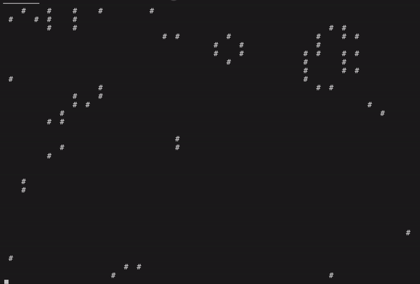

# Cellular Automata

An doodle to create a cellular automata from the [Game of Life of John Conway](https://en.wikipedia.org/wiki/Conway%27s_Game_of_Life) in JavaScript. The script auto resets at a specific generation or if there is not much change in the world.

### Requirements

- node

### Development
  
- To run use:  `node .`

